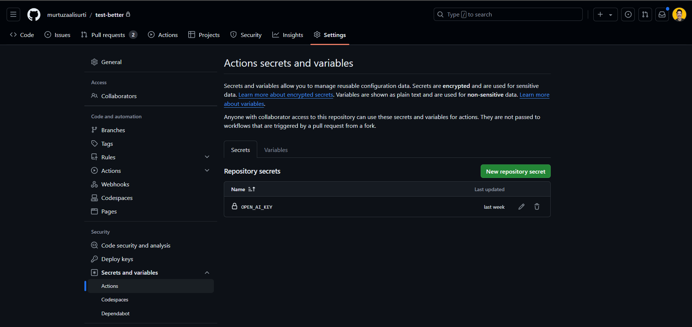
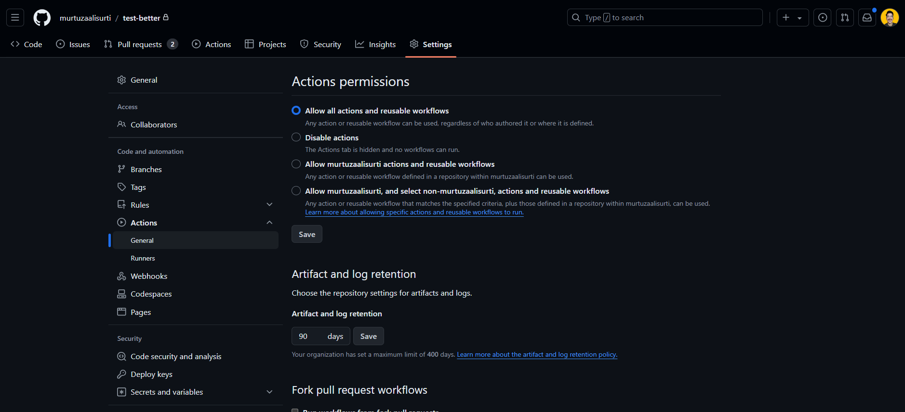

# better

A code reviewer github action powered by AI, ready to be used in your workflow.

## Why use it?

- Standardize your code review process
- Get feedback faster
- Recognize patterns which result in bad code
- Detection of common issues
- Identify security vulnerabilities
- Second opinion
- For humans to focus on more complex tasks

## Usage

### 1. Create a workflow

Create a workflow file inside `.github/workflows` folder (create if it doesn't exist) of your repository with the following content:

```yaml
name: Code Review
on:
    pull_request:
        types: [opened, reopened, synchronize, ready_for_review]
        branches:
            - main # change this to your target branch
    workflow_dispatch: # Allows you to run the workflow manually from the Actions tab

permissions: # necessary permissions
    pull-requests: write
    contents: read

jobs:
    your-job-name:
        runs-on: ubuntu-latest
        name: your-job-name
        steps:
            - name: step-name
              id: step-id
              uses: murtuzaalisurti/better@main # this is the ref of the github action - https://docs.github.com/en/actions/writing-workflows/workflow-syntax-for-github-actions#jobsjob_iduses
              with:
                repo-token: ${{ secrets.GITHUB_TOKEN }} # this is auto generated
                ai-model-api-key: ${{ secrets.OPEN_AI_KEY }} # make sure to set this in your repository secrets - /settings/secrets/actions (Settings > Secrets and Variables > Actions > Secrets Tab)
                delete-existing-review-by-bot: true #default is true
                rules: |- # Rules to consider for code review
                    -- It must follow industry standard best practices
                    -- No unused imports
                    -- No unused variables
                    -- The code should be idiomatic
                    -- The code should be readable
                    -- No unnecessary logs

```

> [!NOTE]
> The `uses` field refers to which github action to use and what's its reference. For example: `murtuzaalisurti/better@main` means it refers to the `main` branch of the `murtuzaalisurti/better` action. If you want to refer to a specific release or tag, you can specify `murtuzaalisurti/better@v1.0.0` which means it refers to the `v1.0.0` of the `murtuzaalisurti/better` action.

---

### 2. Add OpenAI API key to your repository secrets

Go to ***your*** repository settings, `Settings > Secrets and Variables > Actions > Secrets Tab` and add `OPEN_AI_KEY` as a secret with your OpenAI API key as a value. You can refer to it in the workflow file using `${{ secrets.OPEN_AI_KEY }}` against the `ai-model-api-key` field.



---

### 3. Grant permissions

- Go to ***your*** repository settings, `Settings > Actions > General > Actions Permissions Tab` and select `Allow all actions and reusable workflows`.



---

### 4. Run the workflow

Run the workflow by raising a pull request to the target branch mentioned in the `on` section in the workflow.

## Options

### 1. `repo-token`

The `repo-token` is the authorization token of your repository. It is auto generated by GitHub on every workflow run.

---

### 2. `ai-model-name` (Optional)

Specify the name of the model you want to use to generate suggestions. Fallbacks to `gpt-4o-2024-08-06` if not specified. Here's a list of supported models:

- `gpt-4o-mini-2024-07-18` and later
- `gpt-4o-2024-08-06` and later

> This project uses [*Structured Outputs*](https://platform.openai.com/docs/guides/structured-outputs/supported-models) and that's why only the above listed models are supported. More info [here](https://platform.openai.com/docs/models).

---

### 3. `ai-model-api-key`

The `ai-model-api-key` is your OpenAI API key which you have set in your repository secrets.

> *This action only supports OpenAI models for now*.

---

### 4. `delete-existing-review-by-bot` (Optional)

By default, the action will delete any existing review(s) by the bot before creating a new one on every PR push. If you want to keep them, set this option to `false`.

---

### 5. `rules` (Optional)

The rules to consider for code review. It is a multiline text field. Each rule should be on a new line and should start with `--`.

---

> Made with ❤️ by [@murtuzaalisurti](https://github.com/murtuzaalisurti).
